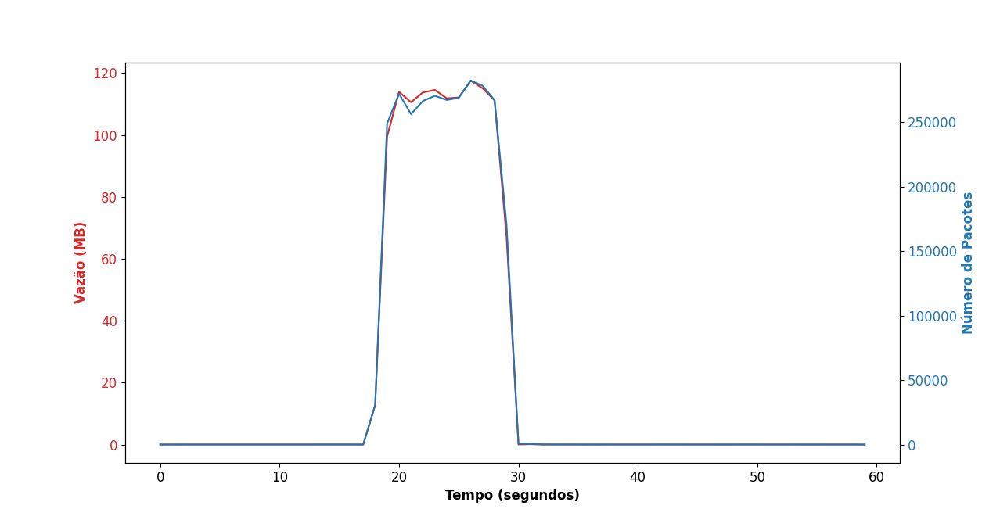

# [MINICURSO SBRC 2024]: Testbeds para Pesquisa Experimental em Cibersegurança: Da Teoria à Prática 

Esse repositório tem como principal apresentar a atividade prática do minicurso **Testbeds para Pesquisa Experimental em Cibersegurança: Da Teoria à Prática** apresentado no evento SBRC 2024 e publicado como capítulo de livro.

O capítulo de livro pode ser acessado em [https://sbrc.sbc.org.br/2024/Ch5.pdf](https://sbrc.sbc.org.br/2024/Ch5.pdf)

Caso deseja citar este trabalho, você pode utilizar o seguinte Bibtex: 


```
@inproceedings{wanghamtestbeds2024,
  title={Testbeds para Pesquisa Experimental em Cibersegurança: Da Teoria à Prática},
  author={Wangham, Michele S.
  and Meyer, Bruno H. and Khalil, G. Q. de Santana and de Campos, Luiz Eduardo Folly and de Mello,Emerson Ribeiro},
  booktitle={Anais do XLII Simp{\'o}sio Brasileiro de Redes de Computadores e Sistemas Distribu{\'\i}dos},
  year={2024},
  organization={SBC}
}
```

## Criando seu experimento de segurança no MENTORED Testbed

Diversos testbeds focados em cibersegurança oferecem soluções para realizar experimentos.
Neste repositório estão disponíveis os arquivos e descrições necessárias para realizar dois tipos de experimentos no [MENTORED Testbed](https://portal.mentored.ccsc-research.org/).

Você pode seguir as instruções oficiais do Testbed para executar seu experimento neste link: [https://portal.mentored.ccsc-research.org/tutorial/](https://portal.mentored.ccsc-research.org/tutorial/) 


### Criação de containers Docker

Esta etapa é quase integralmente definida por quem deseja realizar o experimento.

Quatro containers Dockers foram previamente criados e estão disponíveis no diretório `docker-images`.


Este minicurso assume que você já tenha o conhecimento da tecnologia Docker para definir containers.

Contudo, o MENTORED Testbed fornece diversas facilidades para realizar os experimentos, incluíndo mecanismos de sincronização para início de experimento, criação de arquivos com lista de IPs, entre outras vantagens que reduzem o tempo necessário para definir um experimento.

Uma maneira de acessar essas vantagens é utilizar as imagens disponíveis publicamente. Por exemplo: `ghcr.io/mentoredtestbed/generic-botnet`.

Essas imagens também podem ser usadas como base para criar uma versão extendida customizada. Por exemplo:

```Dockerfile
FROM ghcr.io/mentoredtested/mentored-base

RUN pip3 install --break-system-packages numpy

COPY ./client_web_metrics.py /
```


### Definições de experimentos

Neste repositório você poderá ver dois arquivos YAML: `experiment-definitions/slowloris.yaml` e `experiment-definitions/hping.yaml`.

Esses arquivos consideram uma sintaxe que compartilha elementos com a [sintaxe da tecnologia](experiment-definitions) para definir containers.


Esses arquivos descrevem dois ataques DDoS considerando o seguinte cenário:

- 1 servidor Apache sendo executado em um servidor no **Rio de Janeiro** (`ids-go` para o slowloris) e Paraíba (`ids-pb` para o hping)
  - Além do servidor Apache, um segundo container é usado para monitorar o tráfego de rede com o software `tshark`
- 40 clientes em **Rio Grande do Norte** (`ids-pb`) acessando o servidor Apache com requisições web (HTTP) a cada 1 segundo
  - Os clientes salvam o tempo de solicitação de cada requisição
  - O tempo da solicitação pode ser usado para mensurar a disponibilidade do servidor Apache
- 30 nós atacando o servidor Apache usando os ataques DDoS slowloris ou hping
  - 15 nós no **Rio Grande do Norte** (`ids-rn`)
  - 15 nós em **Minas Gerais** (`ids-mg`)


Linha do tempo (segundos):
- **0 - 20**: Os containers iniciam, o server fica disponível e os clientes iniciam suas requisições
- **20 - 30**: Os atacantes **iniciam o DDoS** enquanto os clientes continuam tentando acessar o servidor
- **30 - 60**: O ataque acaba e os clientes continuam tentando acessar o servidor
- **60 em diante**: Os clientes param de realizar requisições


Para definir os softwares e configurações que serão executadas em cada nós, é necessário criar a lista de `containers` equivalente a uma definiçãod e Pods no Kubernetes. Por exemplo:

```yaml
containers:
  - name: 'client-rn'
    image: ghcr.io/brunomeyer/generic-client:latest
    imagePullPolicy: "Always"
    command: ["/entry.sh"]
    args: ['python3', 'client_web_metrics.py', "1", "1"]
    env:
      - name: TIMEOUT_CMD
        value: "60"
      - name: ADD_SERVER_IP_TO_COMMAND
        value: "true"
    securityContext:
      privileged: true
    resources:
      requests:
        memory: "64Mi"
        cpu: "100m"
      limits:
        memory: "128M"
        cpu: "200m"
```


As outras partes do arquivo YAML são utilizadas pelo MENTORED Testbed para controlar o experimento. Por exemplo, a linha `persitent_volume_path: "/app/packets.pcap"` indica o testbed irá salvar esses arquivos após a conclusão do experimento. 


### Execuções dos experimentos
Siga o [Tutorial](https://portal.mentored.ccsc-research.org/tutorial/) do MENTORED Testbed para fazer upload e executar uma das definições de experimentos deste repositório.

Na página de [execução de experimentos](https://portal.mentored.ccsc-research.org/execution), aguarde seu experimento encerrar.

Quando o experimento finalizar, você poderá baixar os resultados em um formato `.tar.gz`.


### Análise dos resultados

Nos experimentos considerados neste minicurso, dois principais arquivos são salvos:
- `packets.pcap`: Captura de tráfego de rede
- `client_delay.csv`: Mensuramento da disponibilidade de serviço (para cada cliente)

Este repositório contém ferramentas para gerar análises simples sobre esses dados.

Baixe o arquivo `.tar.gz` e oo copie para este diretório. Por exemplo:

```bash
MY_EXP_FILE=experiment_290.tar.gz
cp ~/Downloads/$MY_EXP_FILE .
```

Execute o script para obter a análise dos clientes:
```bash
cd clients-analysis
./create_client_metrics.sh ../$MY_EXP_FILE 20 30
```

Você verá algo semelhante a esse log:
```
Extracted ../experiment_286.tar.gz
Running experiment analyzer...
100%|█████████| 10/10 [00:00<00:00, 2987.61it/s]
Average time for client response (Before 20 seconds)    : 0.020
Average time for client response (20 - 30 seconds)      : 0.108
Average time for client response (After 30 seconds)     : 0.008
Experiment analyzer finished
```

Nos logs anteriores, três intervalos (grupos) foram considerados: Pré-ataque, Ataque e pós-ataque. A média de cada grupo representa o tempo médio no intervalo para obter uma resposta do servidor.

Agora, troque de diretório e execute o script para analizar os resultados do tráfego de rede: 

```bash
cd ..
cd server-analysis
./create_server_metrics.sh ../$MY_EXP_FILE
```

Você verá uma imagem semelhante a essa:



## Considerações finais

Os experimentos apresentados neste minicurso servem como exemplos didáticos para explicar o MENTORED Testbed. Apesar de simples, a definição desses experimentos nos permite observar o potencial e facilidade para criar outros experimentos mais complexos com cenários variados no testbed, que conta com uma infraestrutura baseada no Cluster Nacional da RNP.

Caso tenha alguma dúvida ou deseja entrar em contato, basta mandar um email para [mentored.project@gmail.com](mailto:mentored.project@gmail.com)